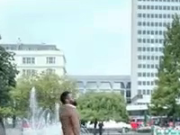
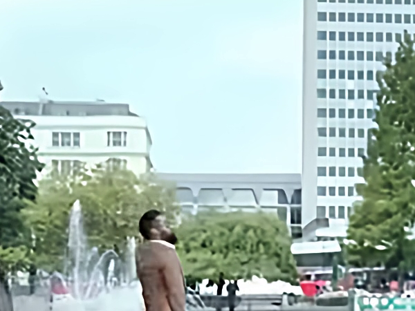

# AI Video Super-Resolution Suite

Enhance low-resolution video using Real-ESRGAN-based AI upscaling, with an end-to-end pipeline (frame extraction → AI enhancement → reassembly with original audio) and a Streamlit web interface.

## Demo

| Original (360p, cropped region) | Enhanced (1080p, same region) |
|---|---|
|  |  |

> **Note on comparing results:** viewing a low-res and high-res video in the same on-screen window size (e.g. side-by-side in a media player) hides the actual resolution difference, since both get scaled to fit. Crop a matching region from each at native pixel size for an honest comparison.

## Overview

This tool takes a low-resolution video and produces a higher-resolution, sharper version using AI-based super-resolution, while preserving the original audio track.

**Pipeline:** extract frames (ffmpeg) → upscale each frame (Real-ESRGAN) → optional sharpening/color grading → reassemble into video with original audio (ffmpeg).

## Architecture

```
Input video
    |
    v
extract_frames.py  -->  raw frames (PNG, lossless)
    |
    v
enhance_frames.py  -->  Real-ESRNet upscale -> optional contrast/saturation -> sharpen
    |
    v
reassemble_video.py  -->  frames -> video (ffmpeg) -> merge original audio
    |
    v
Output video
```

`pipeline.py` ties all three stages together into a single call, used by both the CLI and the Streamlit app (`app.py`).

## Key Technical Decisions

### Why Real-ESRNet, not Real-ESRGAN (GAN variant)

Real-ESRGAN's GAN-trained checkpoint (`RealESRGAN_x4plus.pth`) produces strong results on many images, but on busy/repetitive textures (dense crowds, foliage) it produced a "painted/smeared" artifact - a known consequence of its adversarial training objective, which optimizes for plausible-looking texture rather than pixel accuracy. This project uses `RealESRNet_x4plus.pth` instead: the same architecture, trained with a PSNR-oriented (non-adversarial) loss, which stays closer to genuine resolvable detail. This was confirmed via controlled testing - running the raw model with no tiling and no post-processing isolated the smearing to the model checkpoint itself, not the surrounding pipeline.

### Why no face-specific restoration (GFPGAN / CodeFormer)

Both were evaluated. GFPGAN's `weight` parameter was found to have no effect in the `arch="clean"` checkpoint (confirmed via byte-identical output at different weight values). CodeFormer's fidelity parameter does work, but even at maximum fidelity, it visibly altered a clearly-resolved actor's face (hairstyle, eye color) - a real identity-preservation risk. Since this tool may be used on footage of real, identifiable people, generative face reconstruction was judged too risky in favor of general (non-face-specific) enhancement that only amplifies real pixel data rather than generating new facial features from a learned prior.

### Why contrast/saturation are off by default

Initial testing used aggressive contrast (1.5x) and saturation (1.5x) boosts, tuned on a dim, low-saturation source clip. Applied to a differently-lit source (bright daylight), the same settings clipped the sky to flat white and produced an oversaturated, artificial look. These are now optional, off-by-default flags (`--contrast` / `--saturation`) rather than baked-in defaults, since the right amount is scene-dependent and can't be safely generalized across arbitrary source footage.

## Known Limitations

- **Cannot reconstruct information that was never captured.** Upscaling a 360p video to 1080p improves clarity and adds plausible detail, but it is not equivalent to a genuinely-captured 1080p source - fine detail is a model estimate, not recovered original data.
- **Dense, repetitive textures (large crowds, thick foliage) remain the hardest case** even after switching models - meaningfully improved, but not perfect.
- **Face restoration is not included** by design (see above) - faces are upscaled at the same fidelity as the rest of the frame, not specifically reconstructed.
- **Processing time scales with resolution and frame count.** A short clip upscaled to 1080p on an 8GB GPU takes a few minutes; long or high-resolution videos are not currently practical on this hardware without further optimization (tiling, batching, or a lighter model).

## Hardware Notes (8GB VRAM)

- Real-ESRGAN tiling (`--tile`) is required to avoid CUDA out-of-memory errors at higher resolutions/upscale factors. Default is 400; lower it (e.g. 200) if you hit OOM errors.
- `half=True` (FP16 inference) is used throughout to roughly halve VRAM usage with minimal quality impact.
- Denoising (`cv2.fastNlMeansDenoisingColored`) is CPU-bound and slow at large resolutions - disabled by default, available via `--denoise`.

## Setup

### 1. Create and activate a virtual environment

```bash
python -m venv video-restoration-venv
video-restoration-venv\Scripts\activate.bat
```

### 2. Install PyTorch with CUDA support

Install this *before* the rest of requirements.txt - a plain pip install would give you the CPU-only build.

```bash
pip install torch torchvision torchaudio --index-url https://download.pytorch.org/whl/cu128
```

(Use the CUDA version matching your GPU/driver - see [pytorch.org/get-started/locally](https://pytorch.org/get-started/locally/))

### 3. Install remaining dependencies

```bash
pip install -r requirements.txt
```

### 4. Install ffmpeg

Download from [gyan.dev/ffmpeg/builds](https://www.gyan.dev/ffmpeg/builds/) and add the `bin` folder to your system PATH.

### 5. Download model weights

```bash
mkdir models
curl -L -o models/RealESRNet_x4plus.pth https://github.com/xinntao/Real-ESRGAN/releases/download/v0.1.1/RealESRNet_x4plus.pth
```

## How to Run

### Command line

```bash
python src/pipeline.py input_videos/your_video.mp4 output_videos/enhanced.mp4 --outscale 3
```

Options:
- `--outscale` - upscale factor (2, 3, or 4)
- `--tile` - tile size for VRAM management (lower = less VRAM, slower)
- `--contrast` / `--saturation` - enable optional color grading
- `--sharpen-amount` - sharpening strength, 0-1 (default 0.5)

### Web interface

```bash
streamlit run app.py
```

Upload a video, choose settings, and download the enhanced result directly from the browser.

## Project Structure

```
video-restoration-suite/
├── src/
│   ├── extract_frames.py
│   ├── enhance_frames.py
│   ├── reassemble_video.py
│   └── pipeline.py
├── app.py                  # Streamlit UI
├── models/                 # Model weights (not tracked in git)
├── requirements.txt
└── README.md
```

## Tech Stack

Python, PyTorch, Real-ESRGAN (RRDBNet architecture), OpenCV, ffmpeg, Streamlit